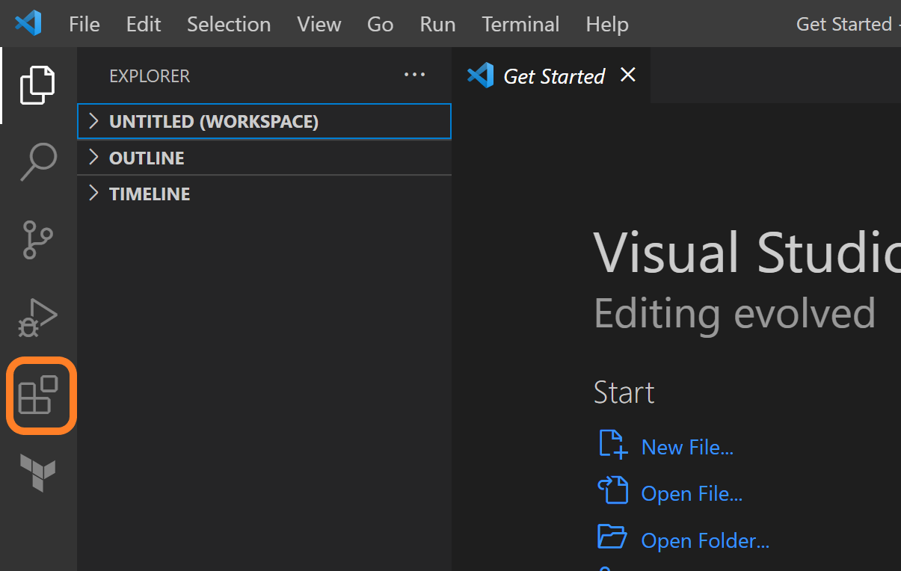
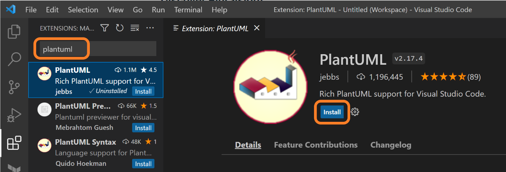
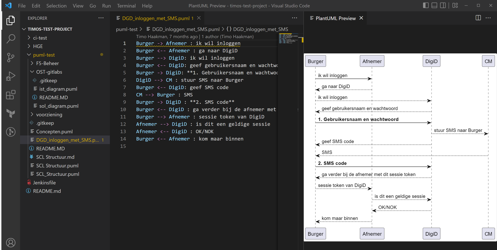
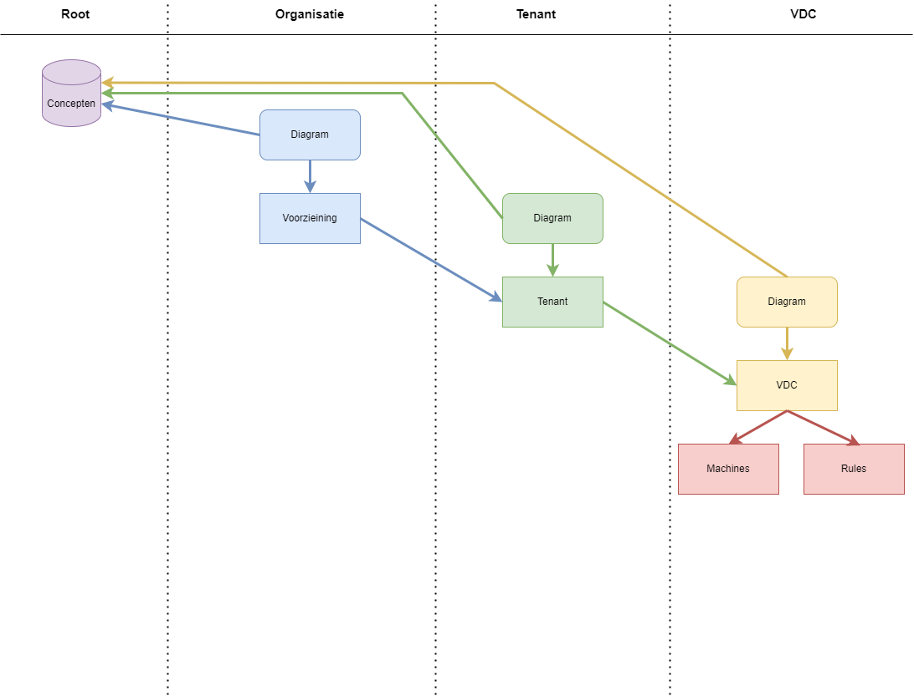
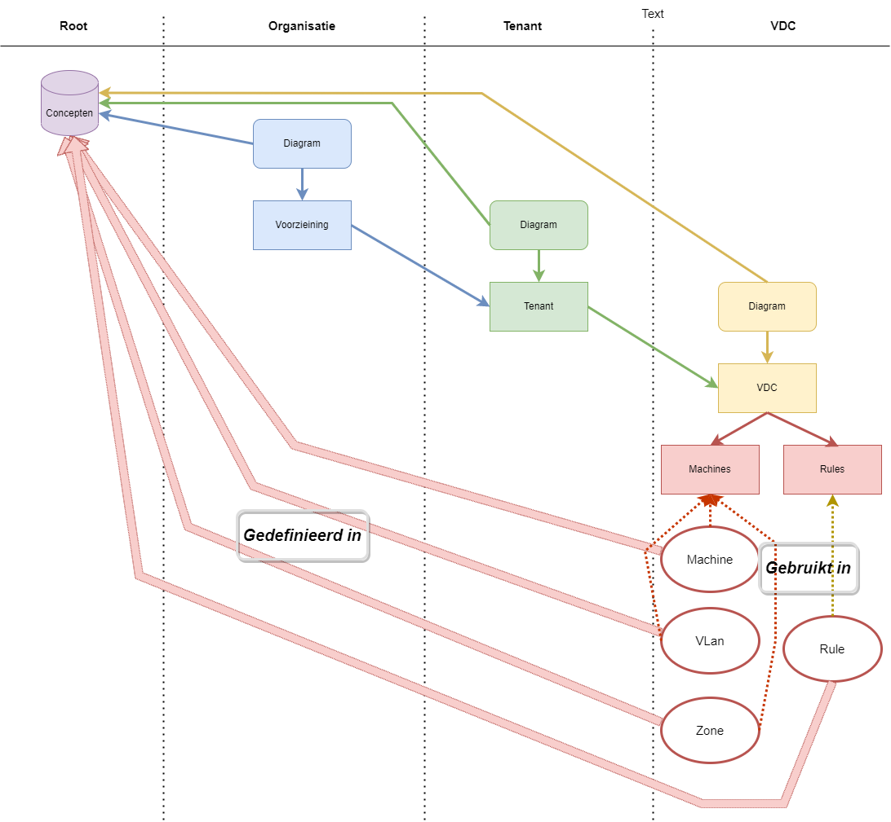

Deze handleiding moet het mogelijk maken om je omgeving te prepareren op het lezen, maken en wijzigen van PlantUML (PUML) bestanden. Er wordt uitgelegd wat voor software je nodig hebt / moet installeren en hoe de PlantUML structuur in elkaar zit, zoals we die gebruiken binnen Capgemini op het Logius project, onderdelen DigiD en DigiD-Machtigen.

Mogelijk zijn niet alle stappen in dit document nodig en/of is bepaalde informatie al bekend. Het document is zo opgesteld dat iemand die minimale kennis van de onderliggende systemen (GIT / Repositories / VSCode / PlantUML) toch aan de slag kan. Daarnaast kan het als naslagwerk gebruikt worden indien er een refresher nodig is over de manier waarop er binnen Capgemini, projecten Logius DGD en DDM diagrammen gemaakt worden.

Dit document is o.a. opgesteld a.h.v. de bespreking van een test-repo van Timo Haakman. Deze besprekingen zijn opgenomen :

[Meeting 1](https://capgemini-my.sharepoint.com/:v:/p/caspar_lourens/ERyYoY-C_z9HqyPbtH1dkMkBlWZ5nHSyCZZEO5tS2imomg)

[Meeting 2](https://capgemini-my.sharepoint.com/:v:/p/caspar_lourens/EYuyjgOI8A9LtmUpaX2qnoUBDE4Rb6tjtQG_Za4_Mxj_2Q)

Bovenstaande links verwijzen naar opnames van Teams overleggen.

De repo die als voorbeeld gediend heeft :

<https://ost.digid.nl/gitlab/tihaa/timos-test-project>

De repo waarin we wat aanpassingen aangebracht hebben (en die ook vermeld wordt in de opnames) :

<https://ost.digid.nl/gitlab/digid-private/scl/infra-design>

# Versie beheer

<table>
    <thead>
        <tr>
            <th>Versie</th>
            <th>Status</th>
            <th>Datum</th>
            <th>Wie</th>
            <th>Opmerking</th>
        </tr>
    </thead>
    <tbody>
        <tr>
            <td>0.1</td>
            <td>Alpha</td>
            <td>13-10-2022</td>
            <td>Caspar Lourens</td>
            <td>1e versie</td>
        </tr>
        <tr>
            <td>0.2</td>
            <td></td>
            <td>18-10-2022</td>
            <td>Caspar Lourens</td>
            <td>Tekening van PlantUML structuur toegevoegd</td>
        </tr>
        <tr>
            <td>0.3</td>
            <td></td>
            <td>25-10-2022</td>
            <td>Caspar Lourens</td>
            <td>Omzetting van Word naar MarkDown</td>
        </tr>
        <tr>
            <td></td>
            <td></td>
            <td></td>
            <td></td>
            <td></td>
        </tr>
    </tbody>
</table>


# Inhoudsopgave
- [IDE](#ide)
- [GIT](#git)
- [PlantUML](#plantuml)
___

# IDE

Voor IDE (Integrated Development Environment) gebruiken we hier VSCode van Microsoft. Dit is gratis te installeren en ondersteund meerdere programmeer talen, XML, YAML, JSON, etc. (dus ook handig voor bijv. Ansible en Terraform).

Je kan deze applicatie hier ophalen <https://code.visualstudio.com/>.

Na installatie is het handig om een aantal extensies te installeren, o.a. die voor PlantUML. Dit doe je door naar Extensions te gaan (menu View Extensions / [ Ctrl + Shift + X ] (Windows) / icoon op de linker menubalk).



In het extensions overzicht zie je reeds geinstalleerde extensions en kan je zoeken naar nieuwe. Makkelijkste manier is om de naam in te typen in de zoekbox bovenin.



In dit geval is de eerstgenoemde optie ook de extensie die het laatst bijgewerkt is en hier gebruikt kan worden (auteur Jebbs, versie 2.17.4 op moment van maken document, laatste update 09-05-2022). Om deze extensie te installeren, klik op de Install knop of open de Quick Open optie \[ CTRL + P \] en type `ext install plantuml`.

Na installatie scroll je, onder Details, door naar requirements en volg je de stappen om o.a. Java en Graphviz te installeren (verschilt per OS).

Om nu een voorbeeld te zien van een PlantUML diagram kan je de toetscombinatie \[ ALT + D \] gebruiken en dan wordt het werkvlak in 2 delen gedeeld waarbij het rechterdeel het voorbeeld van de PlantUML diagram laat zien. Als je wat aanpast in het diagram (linker venster) dan wordt dat vrijwel direct aangepast in het voorbeeld.



# GIT

  - [Installatie](#installatie)
  - [Uitvoeren commando's - workflow](#uitvoeren-commandos---workflow)
  - [Token aanmaken](#token-aanmaken)
  - [Veel gebruikte commando's](#veel-gebruikte-commandos)
    - [Clone](#clone)
    - [Status](#status)
    - [Add](#add)
    - [Commit](#commit)
    - [Push](#push)
    - [Merge](#merge)
    - [Help](#help)
    - [Pull / Fetch](#pull--fetch)
    - [Branch / Checkout](#branch--checkout)
___
## Installatie

GIT is een applicatie om lokaal als VCS (Version Control System) te gebruiken, meer info.

Om git te kunnen gebruiken, moet je het eerst installeren. Dit ka op de volgende manier.

Voor Windows kan je naar <https://gitforwindows.org/> of <https://git-scm.com/> gaan en daar het installatie pakket ophalen. Op de 2^e^ URL (<https://git-scm.com/>) kan je ook een versie voor Linux of Mac ophalen.

Gedurende de installatie van GIT wordt er o.a. gevraagd welke standaard editor je wil gebruiken. Het is handig om hier Visual Studio Code te kiezen, aangezien we die eerder al geinstalleerd hebben om met PlantUML te kunnen werken. Het is aan te beveln om verder voor de aanbevolen opties te kiezen.

Zodra de installatie klaar is, kan je GIT gebruiken op de command-line. Onder windows kan je deze gebruiken door de "Command Prompt" of "Windows PowerShell" applicaties op te starten.

Hier kan je dan controleren of alles werkt door `git version` in te tikken, waarna je informatie terugkrijgt over de geinstalleerde versie van GIT.

Om te controleren of je de laatste versie hebt (en evt. een update te installeren), gebruik je het commando `git update`.

Voor meer informatie over de werking van GIT, zie o.a. hier : <https://git-scm.com/doc>.

## Uitvoeren commando's - workflow

De git commando's kan je op meerder manieren uitvoeren. Het is wel aan te raden om dit zoveel mogelijk vanaf een commandline te doen i.p.v. er grafische oplossingen voor te gebruiken omdat je op deze manier beter leert hoe het hele GIT proces in elkaar steekt.

Binnen VS Code kan je een terminal scherm opstarten (Menu Terminal New Terminal), waarna er een nieuw venster binnen je VS Code scherm geopend wordt (meestal aan de onderkant). Op Windows is dit standaard een PowerShell command line.

Je kan ook zelf een Windows PowerShell omgeving starten via Start Windows PowerShell Windows PowerShell. De ISE kan ook, echter is dat meer een uitgeklede IDE, speciaal voor PowerShell.

Je kan ook de "DOS prompt" opstarten (Start Windows System Command Prompt / \[ Start + R \] cmd \[ Enter \]).

Voor Linux en Mac zijn er andere opties.

Als je meer kennis van GIT hebt opgebouwd dan kan je evt. een extensie als [GitLens](https://www.gitkraken.com/gitlens) in VSCode installeren om de workflow te beheren. Er zijn ook andere, stand-alone applicaties, beschikbaar (o.a. [GitKraken](https://www.gitkraken.com/), [Github dekstop](https://desktop.github.com/), [SourceTree](https://www.sourcetreeapp.com/), [Sublime Merge](https://www.sublimemerge.com/) en [vele anderen](https://git-scm.com/downloads/guis))

## Token aanmaken

Om de PUML diagrammen in de repository, waarnaar verwezen wordt in de Readme.md bestanden, als tekening te laten zien, is het nodig om een token aan te maken en dat token in de URL's te plaatsen.

Dit token maak je aan als een ...... \<wachten op Timo voor meer info\>

## Veel gebruikte commando's

Hieronder volgen een aantal commando's, met uitleg, die veel gebruikt worden bij het aanmaken en bijwerken van PUML bestanden binnen bestaande repositories.

Om een beter begrip te krijgen van de werking van GIT en hoe de workflow in elkaar zit, kan je o.a. [hier](https://www.atlassian.com/git/tutorials/learn-git-with-bitbucket-cloud) meer informatie vinden. Op Degreed kan je ook [info](https://degreed.com/learning/search?term=git) vinden, evenals op [PluralSight](https://app.pluralsight.com/search/?q=git).

### Clone

Om te starten maak je eerst een lokale kopie van de bestanden die op de repository staan. Dit doe je door de volgende stappen uit te voeren :

1.  Ga naar een command-prompt / terminal scherm

2.  Ga naar de folder waar je je lokale repository data wil opslaan en/of maak deze aan

3.  Kopieer de "Clone URL" die je kan vinden in de root van de Repository in een webbrowser (Clone with HTTPS)

4.  Op de Command prompt voer het volgende commando in `git clone <Clone URL>`, bijv. `git clone https://ost.digid.nl/gitlab/tihaa/timos-test-project.git`

5.  Je ziet dan het verloop van de clone actie. Er wordt nu data gekopieerd van de repository naar je lokale folder.

6.  Als je nu controleert dan zie je een nieuwe folder met de naam van de repo die je gekloond hebt.

### Status

Om de status van git te controleren, voer je het volgende commando in, binnen de lokale repo-folder `git status`

Op deze manier kan je zien of alle lokale wijzigingen doorgezet zijn naar de locatie waarvandaan je de data hebt gekloond.

### Add

Indien je wat gewijzigd / toegevoegd hebt (lokaal t.o.v. de repository) dan kan je dat zien met het opvragen van de status.

Indien je de wijzigingen wil toevoegen aan de lokale GIT repo, dan kan je dat doen met het commando `git add <bestandsnaam>` of `git add .` (daarmee voeg je alle openstaande wijzigingen toe).

### Commit

Als de lokale wijzigingen zijn toegevoegd met het add commando, dan kan je dat o.a. zien met het opvragen van de status. Volgende stap is deze te "commit"en. Dit doe je door op de command line `git commit -m "<korte omschrijving>"`. Het is hier handig om een omschrijving te gebruiken die slaat op de wijziging die je gemaakt hebt, waarbij anderen begrijpen waarom de commit gedaan is zonder te uitgebreid te worden.

Als de commit correct is uitgevoerd zie je dat op de command prompt.

### Push

Om de wijzigingen, die nog steeds lokaal staan, nu door te zetten naar de centrale repository (zodat iedereen er later ook bij kan / gebruik van kan maken), zet je de wijzigingen door m.b.v. het commando `git push <remote> <branch>`. Hierbij geldt dat <remote> staat voor de "branch" waarvandaan je de data hebt gekloond. Voor <branch> vul je de lokaal aangemaakte branch in (deze wordt standaard aangemaakt bij clone en krijgt dezelfde naam als de branch naam van het origineel (de repository).

### Merge

Als de wijzigingen doorgezet zijn m.b.v. het push commando, dan kan de wijziging toegevoegd worden aan de bestaande data in de repository. Dit doe je door een merg uit te voeren. Je kan dit vanaf de command line uitvoeren, maar je kan hiervoor ook naar de GUI van de repository (web pagina) gaan en dan kiezen voor Repo Merge requests New Merge request.

Op de command line kan je dit doen door `git merge` in te typen.

### Help

Indien je niet (meer) precies weet hoe een bepaald commando werkt en/of welke opties je moet gebruiken, dan kan je via `git help <commando>` of `git help` informatie krijgen. De betreffende help pagina verschijnt dan in een nieuw tabblad in je favoriete browser.

### Pull / Fetch

Om de lokale kloon weer gelijk te trekken met wat er in de repository staat, kan je een `git pull` uitvoeren. Dit commando haalt de wijzigingen op van de bron (repository) en slaat deze direct op in jouw lokale folder. Hierbij kan het zijn dat lokale wijzigingen overschreven worden.

Daarom is er de mogelijkheid om met `git fetch` wel wijzigingen op te halen maar dan later zelf de keuze te maken om lokale wijzigingen te overschrijven, of niet. Indien je eerst de wijzingen door wil geven aan de bron, dan volg je de stappen Add, Commit en Merge.

Het is slim om, als je aan de slag gaat met een lokale kloon van een repository om aan het begin een pull uit te voeren om zodoende de laatste versie beschikbaar te hebben en geen onnodige problemen te veroorzaken. Als je net een clone hebt gedaan, dan is deze stap niet nodig.

### Branch / Checkout

Voordat je wijzigingen gaat maken, is het verstandig om een branch aan te maken, zodat je achteraf niet met een merg conflict komt te zitten, indien er bijv. meerder mensen tegelijk wijzigingen aan het doorvoeren zijn in dezelfde repository.

Een nieuwe branch maak je aan met het command `git branch <nieuwe branch naam>`. Let wel op; je hebt nu enkel lokaal deze branch aangemaakt, je werkt er nog niet in.

Werken in de nieuwe branch doe je door `git checkout <nieuwe branch naam>` uit te voeren.

Via de commando's `Add`, `Commit` en `Merge` zet je lokale branch door naar de bron (repository).

# PlantUML 

  - [Introductie](#introductie)
  - [Structuur](#structuur)
    - [Root](#root)
    - [Organisatie](#organisatie)
      - [Voorziening_diagram.puml](#voorziening_diagrampuml)
      - [Voorziening.puml](#voorzieningpuml)
    - [Tenant(x)](#tenantx)
      - [Tenant_diagram.puml](#tenant_diagrampuml)
      - [Tenant.puml](#tenantpuml)
    - [VDC(x)](#vdcx)
      - [Vdc_diagram.puml](#vdc_diagrampuml)
      - [](#)
      - [Vdc.puml](#vdcpuml)
      - [Vdc_machines.puml](#vdc_machinespuml)
        - [Zone](#zone)
        - [VDC](#vdc)
        - [VLan](#vlan)
        - [Machine](#machine)
      - [Vdc_rules.puml](#vdc_rulespuml)
___
## Introductie

PlantUML is een standaard om diagrammen te maken o.b.v. code in UML bestanden. UML staat voor Unfied Modeling Language, meer informatie kan je [hier](https://nl.wikipedia.org/wiki/Unified_Modeling_Language) vinden.

Binnen het Logius project, specifiek voor de onderdelen DigiD (DGD) en DigD-Machtigen (DDM) gebruiken we PlantUML om diagrammen te maken vanuit de blik van architecten op de omgeving waarin wij werken (EASI, EQAP, Picard, LPC, ....). De diagrammen zouden zo duidelijk moeten zijn dat o.b.v. deze tekeningen het duideljk is wat er aangevraagd en geinstalleerd moet worden. Tevens is het te gebruiken binnen overleggen en als documentatie.

De afspraak is dat we deze diagrammen en dan specifiek de PlantUML (PUML) bestanden (UML Code) opslaan in de GIT repository van de omgeving waar de betreffende tekeningen van gemaakt zijn.

Voor meer informatie over PlantUML en hoe diagrammen opgebouwd / gestructureerd zijn kan je o.a. op deze locaties kijken :

-   <https://plantuml.com/>

-   <https://crashedmind.github.io/PlantUMLHitchhikersGuide/>

-   <https://plantuml.com/guide>

-   <https://real-world-plantuml.com/>

-   <https://plantuml-documentation.readthedocs.io/en/latest/index.html>

## Structuur

Opzet van een standaard folder structuur ziet er als volgt uit :


In een tekening (het Diagram wordt iedere keer aangeroepen vanuit een readme.md (markdown) bestand in de betreffende GIT folder) :



Bovenstaande is geen universele PlantUML standaard, echter is dit wat wij binnen DGD en DDM hebben afgesproken. Op deze manier kunnen we sneller diagrammen maken die grote gelijkenis met elkaar vertonen zonder iedere keer opnieuw "het wiel uit te moeten vinden".

Indien er zaken zijn die niet (meer) werken, beter kunnen, toegevoegd moeten worden, etc. dan kan dat altijd. Zorg er echter wel voor dat er onderling overleg is in het architecten team zodat er weer overeenstemming is over de gewijzigde zaken. Vervolgens moeten alle mensen die gebruik maken van PlantUML / diagrammen maken op de hoogte gesteld worden.

Het eenzijdig uitvoeren van wijzigingen kan gevolgen hebben voor alle bestaande en toekomstige diagrammen / tekeningen en kan zodoende voor een verstoring van productie zorgen, let dus goed op !!!

### Root

In de root van de repository (de startfolder) komt de Concepten.puml. Dit bestand bevat de basis elementen voor alle ander PUML bestanden en wordt daar vandaan aangeroepen. Hieronder staat een stukje code uit de Concepten.puml :
~~~~
/' Concepten.puml

Gebruikte Variabelen
$verbose - moet worden geset in de diagram file\
'/

!$colorSecurity = blue
!$colorStorage = red
!$colorDiginetwerk = green

/' Concept machine

syntax: machine(naam, "nic0 IP", "nic1 IP", "nic2 IP", CpuCount, CoresPerCPU, memory, osDiskSize, additionalDisksSizes, type, verbose)

- type is te mappen met role (containerserver, databaseserver, .. ) of is een vrije tekst die het doel van de server beschrijft
- naam is opgebouwd uit <tenantnaam><omgevingnaam><servertype><volgnummer>
- laat IP adressen leeg als ze nog net bekend zijn
- additionalDisksSizes is bijvoorbeeld: "3GB+5GB"

Gebruikte Variabelen
$verbose - indien false wordt alleen de naam getoond
'/

!$machines = {"name": "aap"}

!$machine = ""

!definelong machine(e_name, e_nic0ip, e_nic1ip, e_nic2ip, e_specsdescription, e_type, e_verbose)

!if (e_verbose == true)

!if (e_nic2ip == geen)

[e_name] <<e_specsdescription>> as "\n----\ne_name\n----\n""0:e_nic0ip""\n""<i><color:$colorSecurity>1:e_nic1ip</color></i>"""

!else

[e_name] <<e_specsdescription>> as "\n----\ne_name\n----\n""0:e_nic0ip""\n""<i><color:$colorSecurity>1:e_nic1ip</color></i>""\n""<i><color:$colorStorage>2:e_nic2ip</color></i>"""

!endif

!else

[e_name]

!endif

!$machine = '{"name": '+e_name+'}'

!$machines = $machines + "," + $machine

!enddefinelong

!definelong machine(e_name, e_nic0ip, e_nic1ip, e_nic2ip, e_cpus, e_cores, e_mem, e_osdisk, e_otherdisks, e_type)

machine(e_name, e_nic0ip, e_nic1ip, e_nic2ip, e_cpus, e_cores, e_mem, e_osdisk, e_otherdisks, e_type, false)

!enddefinelong

!definelong machine(e_name, e_nic0ip, e_nic1ip, e_nic2ip, e_cpus, e_cores, e_mem, e_osdisk, e_otherdisks, e_type, e_verbose)

machine(e_name, e_nic0ip, e_nic1ip, e_nic2ip, "cpu:e_cpus x e_cores mem:e_mem disk:e_osdisk+e_otherdisks", e_type, e_verbose)

!enddefinelong
~~~~
In dit stukje wordt eerst bepaald welke standaard kleuren er gebruikt worden. Daarna wordt de opmaak van een machine naam bepaald a.h.v. variabelen die in latere PUML bestanden gevuld worden.

In alle regels tussen " /' " en " '/ " staat het commentaar (commentaar blok) en dit wordt niet meegenomen in de verdere uitwerking van een diagram. Hetzelfde geldt voor een regel die begint met " ' " (commentaar regel).

In principe is de Concepten.puml een statisch bestand. Mocht er toch iets aangepast / bijgevoegd moeten worden, overleg dan met de betreffende architecten om overeenstemming te krijgen in de aanpassing. Mogelijk dat dan de Concepten.puml ook in andere repositories aangepast moet worden. Het is wel aanbevolen om de Concepten.puml zo veel mogelijk gelijk te houden om de werking van PUML bestanden binnen de Logius diagrammen zo voorspelbaar mogelijk te maken.

### Organisatie

Binnen de organisatie kennen we 2 bestanden :

#### Voorziening_diagram.puml

Deze bevat de verwijzing naar de Concepten.puml (root) en Voorziening.puml (Organisatie folder). Dit bestand wordt aangeroepen vanuit de Readme.md in de organisatie folder om zodoende de beschreven diagram te tonen als een tekening.

Een voorbeeld staat hieronder.
~~~
Title Bouwontwerp Voorziening VZ

!$verbose = false

!includeurl http://plantuml:<token>@<GitLab IP>:<Port nummer>/gitlab/tihaa/timos-test-project/-/raw/master/puml-test/Concepten.puml?cache=no

!includeurl http://plantuml:<token>@<GitLab IP>:<Port nummer>/gitlab/tihaa/timos-test-project/-/raw/master/puml-test/voorziening/voorziening.puml?cache=no

addTables()
~~~
In bovenstaande voorbeeld moeten de volgende stukken vervangen worden door daadwerkelijke en geldige data :

-   <token> Zie [hier](#token-aanmaken) voor meer informatie.
-   <Gitlab IP> Het adres van de Gitlab repository server die gebruikt wordt
-   <Port nummer> Het poort nummer waar de Gitlab server op bereikbaar is

#### Voorziening.puml

Dit diagram wordt aangeroepen vanuit Voorziening_diagram.puml en verwijst weer door naar div. tenant PUML bestanden. Een voorbeeld staat hieronder.
~~~
/'
Voorziening definitie file

Voegt de Tenants van Voorziening en onderlinge verkeersstromen samen
'/

' Voeg de Tenants's (met hun interen rules) toe aan de Voorziening

voorziening(Voorziening1){

!includeurl http://plantuml:<token>@<GitLab IP>:<Port nummer>/gitlab/tihaa/timos-test-project/-/raw/master/puml-test/voorziening/tenant1/tenant.puml?cache=no

!includeurl http://plantuml:<token>@<GitLab IP>:<Port nummer>/gitlab/tihaa/timos-test-project/-/raw/master/puml-test/voorziening/tenant2/tenant.puml?cache=no

}

\' Voeg de rules tussen de Tenants toe

http://plantuml:<token>@<GitLab IP>:<Port nummer>/gitlab/tihaa/timos-test-project/-/raw/master/puml-test/voorziening/voorziening_rules.puml?cache=no
~~~
### Tenant(x)

Binnen een tenant kennen we ook weer 2 bestanden :

#### Tenant_diagram.puml

Deze bevat de verwijzing naar de Concepten.puml (root) en Tenant.puml (Tenant(x) folder). Dit bestand wordt aangeroepen vanuit de Readme.md in de tenant(x) folder om zodoende de beschreven diagram te tonen als een tekening.

Een voorbeeld staat hieronder.
~~~
Title Bouwontwerp Tenant1

!$verbose = false

http://plantuml:<token>@<GitLab IP>:<Port nummer>/gitlab/tihaa/timos-test-project/-/raw/master/puml-test/Concepten.puml?cache=no

http://plantuml:<token>@<GitLab IP>:<Port nummer>/gitlab/tihaa/timos-test-project/-/raw/master/puml-test/voorziening/tenant1/tenant.puml?cache=no

addTables()
~~~
#### Tenant.puml

Hier wordt verwezen naar de in de VDC(x) subfolder(s) aanwezig PUML bestanden. Een voorbeeld staat hieronder.
~~~
/'
Tenant definitie file
Voegt de VDC's van een Tenant en onderlinge verkeersstromen samen
'/

' Voeg de VDC's (met hun interne rules) toe aan de tenant

tenant(tenant1){

http://plantuml:<token>@<GitLab IP>:<Port nummer>/gitlab/tihaa/timos-test-project/-/raw/master/puml-test/voorziening/tenant1/tenant1-vdc1/vdc.puml?cache=no

http://plantuml:<token>@<GitLab IP>:<Port nummer' \>/gitlab/tihaa/timos-test-project/-/raw/master/puml-test/voorziening/tenant1/tenant1-vdc2/vdc.puml?cache=no

}

' Voeg de rules tussen de VDC's toe

http://plantuml:<token>@<GitLab IP>:<Port nummer'\>/gitlab/tihaa/timos-test-project/-/raw/master/puml-test/voorziening/tenant1/tenant_rules.puml?cache=no
~~~
### VDC(x)

Dit is het diepste niveau dat we hier onderkennen. In deze folder / dit niveau hebben we 4 verschillende PUML bestanden :

In tekening ziet het er zo uit :



#### Vdc_diagram.puml

Deze bevat de verwijzing naar de Concepten.puml (root) en vdc.puml (Tenat(x) / Vdc(x) folder). Dit bestand wordt aangeroepen vanuit de Readme.md in de vdc(x) folder om zodoende de beschreven diagram te tonen als een tekening.

Een voorbeeld staat hieronder.
~~~
Title Bouwontwerp vdc1 van Tenant1

!$verbose = true

http://plantuml:<token>@<GitLab IP>:<Port nummer>/gitlab/tihaa/timos-test-project/-/raw/master/puml-test/Concepten.puml?cache=no

http://plantuml:<token>@<GitLab IP>:<Port nummer>/gitlab/tihaa/timos-test-project/-/raw/master/puml-test/voorziening/tenant1/tenant1-vdc1/vdc.puml?cache=no

addTables()
~~~
#### 

#### Vdc.puml

Hier wordt verwezen naar de vdc_machines.puml en vdc_rules.puml bestanden. Een voorbeeld staat hieronder.
~~~
/'
VDC definitie file

Voegt de machines en rules samen
'/

http://plantuml:<token>@<GitLab IP>:<Port nummer>/gitlab/tihaa/timos-test-project/-/raw/master/puml-test/voorziening/tenant1/tenant1-vdc1/vdc_machines.puml?cache=no

http://plantuml:<token>@<GitLab IP>:<Port nummer>/gitlab/tihaa/timos-test-project/-/raw/master/puml-test/voorziening/tenant1/tenant1-vdc1/vdc_rules.puml?cache=no
~~~
#### Vdc_machines.puml

Dit bestand bevat de machines zoals deze zouden moeten bestaan binnen de VDC waarin je je nu bevindt. De machinenamen waaraan gefereerd wordt, komen uit het vdc_machines.puml bestand. Een voobreeld staat hieronder.
~~~
/'VDC definitie file
Deze file definieert de machines binnen hun vlan's en vdc('s en zones).

ZONE

syntax: zone("AZ1"|"AZ2")
We kennen twee zones: AZ1 en AZ2

VLAN

syntax: vlan(vdc, netwerk, IPreeks, subnet)
- netwerk := external|applicatie|backend|security|storage
security en storage worden meestal niet als apart vlan getekend, de IP adressen hiervan worden meegegeven bij de machine definitie.

MACHINE

syntax: machine(naam, "nic0 IP", "nic1 IP", "nic2 IP", CpuCount, CoresPerCPU, memory, osDiskSize, additionalDisksSizes, type, verbose)
- type is te mappen met role (containerserver, databaseserver, .. ) of is een vrije tekst die het doel van de server beschrijft
- naam is opgebouwd uit <tenantnaam><omgevingnaam><servertype><volgnummer>
- laat IP adressen leeg als ze nog net bekend zijn
- additionalDisksSizes is bijvoorbeeld: "3GB+5GB"

Gebruikte Variabelen
$verbose wordt geset in de diagram file
'/

zone(AZ2) {

vdc(tenant1-vdc1-az2) {

vlan(tenant1-vdc1-az2, external, "10.31.1.1", 26) {

machine(tenant1-vdc1-az2-prxws1, "10.31.1.3", "172.23.12.3", "172.18.12.3", 4, 2, 8G, 100GB, "50GB+10GB", proxywebserver, $verbose)

}

vlan(tenant1-vdc1-az2, applicatie, "10.31.2.1", 26) {

machine(tenant1-vdc1-az2-cs1..8, "10.31.2.3/29", "172.23.12.4/29", "172.18.12.4", 4, 2, 16G, 32GB, 200GB, containerservers, \$verbose)

machine(tenant1-vdc1-az2-nexus1, "10.31.2.11", "172.23.12.11", "172.18.12.11", 4, 2, 16GB, 32GB, 300GB, "Server met Nexus", \$verbose)

}

vlan(tenant1-vdc1-az2, backend, "10.1.3.1", 26) {

machine(tenant1-vdc1-az2-ds1, "10.31.3.2", "172.23.12.12", "172.18.12.12", 4, 2, 16G, 32GB, 12TB, databaseserver, $verbose)

}

}

}

zone(AZ1) {

vdc(tenant1-vdc1-az1) {

vlan(tenant1-vdc1-az1, external, "10.30.1.1", 26) {

machine(tenant1-vdc1-az1-prxws1, "10.30.1.3", "172.22.12.3", "172.17.12.3", 4, 2, 8G, 100GB, "50GB+10GB", proxywebserver, $verbose)

}

vlan(tenant1-vdc1-az1, applicatie, "10.30.2.1", 26) {

machine(tenant1-vdc1-az1-cs1..8, "10.30.2.3/29", "172.22.12.4/29", "172.17.12.4", 4, 2, 16G, 32GB, 200GB, containerservers, $verbose)

machine(tenant1-vdc1-az1-nexus1, "10.30.2.11", "172.22.12.11", "172.17.12.11", 4, 2, 16GB, 32GB, 300GB, "Server met Nexus", $verbose)

}

vlan(tenant1-vdc1-az1, backend, "10.1.3.1", 26) {

machine(tenant1-vdc1-az1-ds1, "10.30.3.2", "172.22.12.12", "172.17.12.12", 4, 2, 16G, 32GB, 12TB, databaseserver, $verbose)

}

}

}
~~~
In dit bestand kennen we 4 verschillende concepten (verwijzing naar Concepten.puml in de root folder) :

##### Zone

In welke zone de machine(s) moeten bestaan. Indien er meerdere zones zijn (AZ = Availability Zone) dan worden deze aangeduid met een unieke naam / nummering.

Voorbeeld : `zone(AZ1)`

##### VDC

Hier wordt de VDC naam bepaald. Deze bestaat uit

-   Tenant naam

-   VDC naam

Voorbeeld: `vdc(tenant1-vdc1-az1)`

##### VLan

Om een VLan te beschrijven worden er 3 variabelen verwacht, gescheiden door een komma :

-   Vdc -- de naam van de VDC waarbinnen dit VLan zich bevindt

-   Netwerk -- de naam van het netwerk. Hier wordt 1 van de volgende mogelijkheden verwacht

    -   External

    -   Applicatie

    -   Backend

    -   Security

    -   Storage

-   IPreeks -- de start van de IP reeks voor de VLan

-   Subnet -- het subnetmasker dat voor dit VLan gebruikt dient te worden (bepaling van het aantal beschikbare IP adressen)

Voorbeeld: `vlan(tenant1-vdc1-az1, backend, "10.10.10.1", 26)`

##### Machine

Zoals te zien worden hier 11 variabelen verwacht per machine, gescheiden door een komma :

-   Naam -- naam van deze machine. Deze is opgebouwd uit de volgende componenten

    -   <tenantnaam> - de naam van de tenant

    -   <omgevingnaam> - de naam van de VDC

    -   <servertype> - type server, in een afkorting

    -   <volgnummer> - start met 1 en loopt op indien er meerdere servers van hetzelfde type zijn binnen deze VDC

-   nic0 IP -- het te gebruiken IP adres voor de 1^e^ netwerkaansluiting

-   nic1 IP -- het te gebruiken IP adres voor de 2^e^ netwerkaansluiting

-   nic2 IP -- het te gebruiken IP adres voor de 3^e^ netwerkaansluiting

-   CpuCount -- totale aantal CPU's voor deze machine

-   CoresPerCPU -- het aantal cores per CPU voor deze machine

-   Memory -- de hoeveelheid geheugen die deze machine moet krijgen

-   osDiskSize -- de grootte van de OS schijf voor deze machine

-   additionalDisksSizes -- de grootte van de additionele schijven

-   type -- de rol die deze machine speelt in de beschreven VDC

-   verbose -- hier wordt verwezen naar de variabele \$verbose die in de \<naam\>\_diagram.puml bestanden bepaald wordt

Voorbeeld: `machine(tenant1-vdc1-az1-bs1, "10.10.10.12", "172.23.12.10", "172.18.12.9", 4, 2, 32GB, 16GB, 100GB+200GB, "Beheerserver, \$verbose)`

Indien er meerdere machines beschreven worden in 1 regel, omdat ze bijv. vergelijkbaar zijn en opeenvolgend qua gegevens dan wordt dat op deze manier beschreven :

`machine(tenant1-vdc1-az2-cs1..8, \"10.31.2.3/29\", \"172.23.12.4/29\", \"172.18.12.4\", 4, 2, 16G, 32GB, 200GB, containerservers, \$verbose)`

Zoals te zien worden hier 8 containerservers beschreven (cs1..8 in de naam geeft dit aan). In dit geval worden er dus eigenlijk 8 machines bedoeld en zal die ene regel in het diagram dus eigenlijk als volgt uitgewerkt kunnen worden in de praktijk :

`machine(tenant1-vdc1-az2-cs1, \"10.31.2.3/29\", \"172.23.12.4/29\", \"172.18.12.4\", 4, 2, 16G, 32GB, 200GB, containerservers, \$verbose)`

`machine(tenant1-vdc1-az2-cs2, \"10.31.2.3/29\", \"172.23.12.4/29\", \"172.18.12.4\", 4, 2, 16G, 32GB, 200GB, containerservers, \$verbose)`

`machine(tenant1-vdc1-az2-cs3, \"10.31.2.3/29\", \"172.23.12.4/29\", \"172.18.12.4\", 4, 2, 16G, 32GB, 200GB, containerservers, \$verbose)`

`machine(tenant1-vdc1-az2-cs4, \"10.31.2.3/29\", \"172.23.12.4/29\", \"172.18.12.4\", 4, 2, 16G, 32GB, 200GB, containerservers, \$verbose)`

`machine(tenant1-vdc1-az2-cs5, \"10.31.2.3/29\", \"172.23.12.4/29\", \"172.18.12.4\", 4, 2, 16G, 32GB, 200GB, containerservers, \$verbose)`

`machine(tenant1-vdc1-az2-cs6, \"10.31.2.3/29\", \"172.23.12.4/29\", \"172.18.12.4\", 4, 2, 16G, 32GB, 200GB, containerservers, \$verbose)`

`machine(tenant1-vdc1-az2-cs7, \"10.31.2.3/29\", \"172.23.12.4/29\", \"172.18.12.4\", 4, 2, 16G, 32GB, 200GB, containerservers, \$verbose)`

`machine(tenant1-vdc1-az2-cs8, \"10.31.2.3/29\", \"172.23.12.4/29\", \"172.18.12.4\", 4, 2, 16G, 32GB, 200GB, containerservers, \$verbose)`

#### Vdc_rules.puml

Dit bestand bevat de verkeerstromen zoals deze zouden moeten lopen binnen de VDC waarin je je nu bevindt. De machinenamen waaraan gefereerd wordt, komen uit het vdc_machines.puml bestand. Een voobreeld staat hieronder.
~~~
/' Deze file definieert de verkeersstromen tussen de machines van deze VDC.
In scope zijn de verkeersstromen:
- tussen machines in dezelfde tier
- tussen machines in verschillende tiers van dezelfde VDC
- tussen machines in verschillende beschikbaarheidszone van dezelfde VDC

syntax: rule(netwerk, van, naar, poort, toelichting)

netwerk := productie|beheer|storage|diginetwerk|internet

external, applicatie en backend vallen hierbij onder productie

voorbeeld1: rule(productie, ba-bu1-az2, a6-ds1-az2, 9102, "bacula deamon")

voorbeeld2: rule(diginetwerk, ba-bu1-az2, "S3 Storage ODC-N", 443, "archivering")
'/

rule(productie, tenant1-vdc1-az2-nexus1, tenant1-vdc1-az2-prxws1, 8888, "internet connectie via proxy")

rule(productie, tenant1-vdc1-az2-cs1..8, tenant1-vdc1-az2-prxws1, 8888, "internet connectie via proxy")

rule(productie, tenant1-vdc1-az2-cs1..8, tenant1-vdc1-az2-nexus1, 443, "Nexus repo")

rule(productie, tenant1-vdc1-az2-cs1..8, tenant1-vdc1-az2-ds1, 3306, "MySQL")
```
Zoals te zien worden hier 5 variabelen verwacht per rule, gescheiden door een komma :

-   Netwerk -- het te gebruiken netwerk, keuze uit

    -   Productie

    -   Beheer

    -   Storage

    -   diginetwerk

    -   Internet

-   Van -- bron van de verkeerstroom (waar start de verkeerstoom)

-   Naar -- bestemming van de verkeerstroom (waar moet de verkeerstroom naar toe)

-   Poort -- welke poort er gebruikt wordt voor deze verkeerstroom (over welke poort moet de verkeerstroom lopen)

-   Toelichting -- een toelichting zodat het duidelijk wordt wat er met deze verkeerstoom bereikt zou moeten worden

Voorbeeld: `rule(productie, tenant1-vdc1-az2-cs1..8, tenant1-vdc1-az2-bs1, 22, "SSH")`
